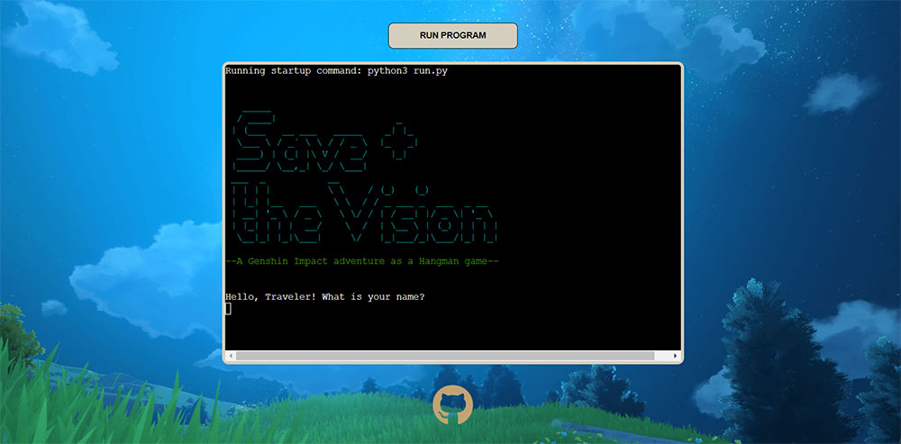
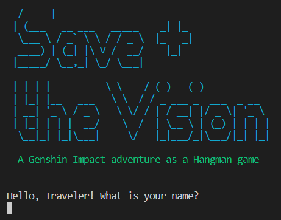
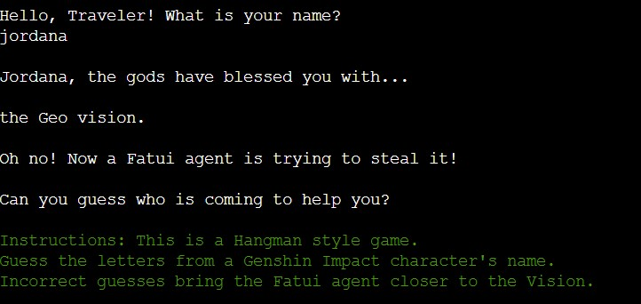
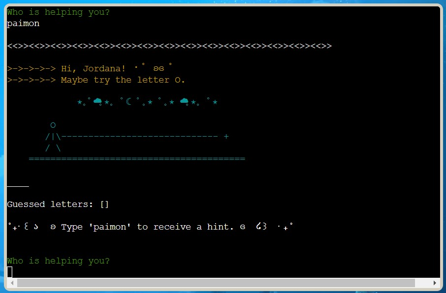
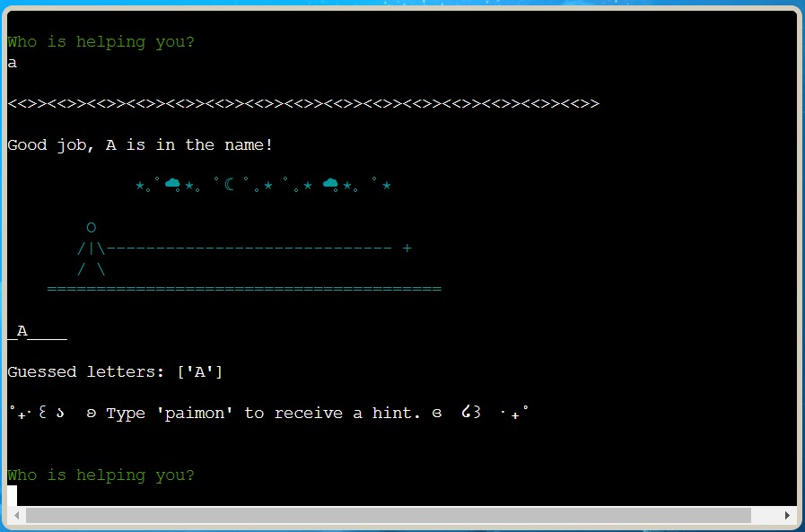
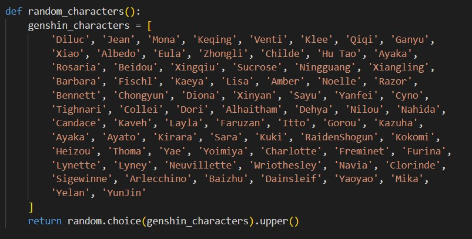
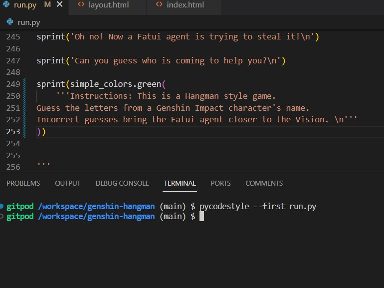
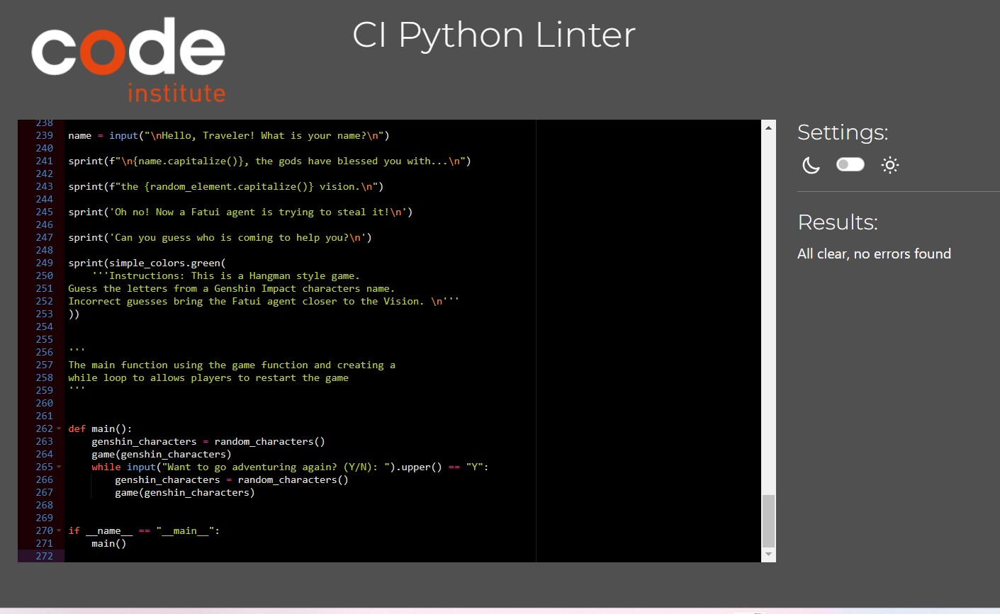

# Save the Vision
*Developed by Jordana Braga*

> "Discover the type of your Vision and protect it from a Fatui agent alongside one of Teyvat's greatest adventurers!"

**Save the Vision** is terminal-based python game using the mechanics of the classic Hangman. It's a tribute to the Genshin Impact's franchise and invites the player on an adventure. 

(Live Website)[https://genshin-hangman-f62fd6be098c.herokuapp.com/]

In this game, the player receives one type of elemental vision and must protect it by finding out which of the beloved Genshin characters will be their partner in (stopping) crime. If the player makes too many wrong guesses, a Fatui agent steals their Vision. 

**Context for Non-Genshin players:** In the world of Genshin, a few people are blessed with an elemental Vision that grants them power over the element. The player is a traveler that meets many adventure companions around the world. The Fatui is an organization that, most of the time, antagonizes the heroes. 

In a sense, Genshin Impact is a game about discovering new friends and saving the day. And in "Save the Vision" this remains true. 

# How to play

The player is prompted to type their name, and then the game starts. The player is assigned a random type of Vision and it's introduced to the game with a story - a Fatui agent is trying to steal their Vision, and they must find out which Genshin character is coming to help.

The player must type a letter or a name of a Genshin character, and try to guess the secret name. 

Mistakes bring the Fatui agent closer to the Vision. 

Correct guesses reveal more about the character's name.

The player has the option of typing "paimon" for a hint. 

If the player guess the name before the Fatui steals the Vision, they win. 

If the player doesn't guess the name, they lose. 

Either way, they have the option of trying again. 

# Features

The player is able to enter their name and have a personalized game

The player receives a random type of Vision

The game accept both letters and full words, in case the player recognizes the name and want to write it all at once.

Input validation and error-checking
- You must enter letters or words
- You cannot enter the same letter or name twice
- It confirms right answers
- It points out invalid inputs
- It accepts the full name of the characters (a word)

Hint system

Guessed letters are displayed 

ASCII graphics to illustrate the Fatui agent getting closer with each mistake

Text narration

Option to restart the game

Specific design that references Genshin Impact

## Future Features
If this game were expanded, it could include:

- The game could go through 4 rounds with a longer narrative as the player discovers and assembles their 4 characters team (the standard in the game). 

- The hint system could be more complex and, instead of hinting letters, it could give suggestions about the character itself to test the player's knowledge. For example: "This character is from the Fontaine region."

- The text color when the Vision is mentioned could change to match the element type. 

# Planning

**Save the Vision, in essence, is a Hangman game with a theme of Genshin characters.** 

The target audience is Genshin Impact players who might want to have a moment of fun challenging themselves, and discovering their Vision type and Genshin partner through a simple guessing game. 

In a way, Save the Vision fullfills the same curiosity of an internet quiz ("What type is your vision?", "Who is your Genshin adventure partner?"). The fact that Genshin is a gacha game (you win characters in a sort of lottery) matches the "luck" component of being assigned a random Vision and character in Save the Vision. 

The game itself is actually hard and entertaining. I implemented the hint system after failing too many times to save my Vision.

The details in the game are made to match Genshin Impact's game identity. The vocabulary, the colors and even the game mechanics reinforce that. 

The stars and moon added to the ASCII graphic relate to the stars symbology in the game. Besides that, creating a sense of scenery is one of the greatest features in Genshin Impact. This is a small ASCII version of that. 

Paimon is a character in the game. She's a small fairy that guides the player. The ASCII details reinforce the character's identity. And she is the one who gives hints in Genshin.

**The player has unlimited hints by design.** The game already has 80 character options, and the names are hard to guess in general. This is challenge enough. Save the Vision is a relaxing, fun game first. And this allows the player to choose how hard they want it to be. Besides that, Genshin Impact itself is a game that might be hard sometimes, but utimately you can always win. 

# Testing

The code passed without errors PEP8 validators.
I experimented both on my terminal and on Heroku terminal writing multiple types of answers to make sure the game would react as expected. 

## Pycodestyle (PEP8)

Pycodestyle (PEP8)

 

## CI Python Linter

CI Python Linter Validation

 

# Deployment

### Deploy
The website was deployed through the use of GitHub.
1. In the desired repository, click on "Settings" from the top menu.
2. From the side menu to your left, select "Pages" in the "Code and automation" section.
3. Make sure the "Source" option is set to "Deploy from a branch"
4. Select the desired "Branch" from the drop down below (main branch in most cases, making sure the director is set to /(root)).
5. Select "Save", and after it refreshes the page, you will see a box at the top of the page providing you with the URL of your now published site.

To contribute or check the code yourself, you can fork or clone the repository as well.

### Fork
1. Go to the desired repository
2. Click "Fork" in the upper right corner
3. Select the owner, and set the repository name. A description can be added if desired
4. Choose whether to copy the default branch, or all branches
5. Click "Create Form"

### Clone

1. Go to the desired repository
2. Click the "Code" button at the top of the files section of the page
3. Select your desired method for cloning (HTTPS/SSH/GitHub CLI)
4. Open Git Bash
5. Change the current working directory to the location where you want the cloned directory
6. Type "git clone", and then paste the URL you copied earlier. It will look like this, with your GitHub username instead of "YOUR-USERNAME": "$ git clone https://github.com/YOUR-USERNAME/DESIRED-REPOSITORY"
7. Press Enter. Your local clone will be created.

### Heroku

1. Create a user account with Heroku.
2. Click New in the top-right corner of your Heroku Dashboard.
3. Click on the dropdown menu and select create new.
4. The app name is unique to all apps within Heroku so select one that is not currently in use.
5. Select a region, EU or USA.
6. Click Create App.
7. In the app settings click Reveal Config vars, set the value of KEY to PORT, and the value to 8000 and click add.
8. Click Add Buildpack.
9. Choose Python first and click add.
10. Choose Node.js second.
11. The order is important, Python needs to be first, then Node.js second.
12. Click on the Deploy tab, select connect to Github and search for your repository.
13. Click on Enable automatic deploy or Deploy branch depending on your use case.

# Credits

- Code Institute for the deployment terminal
- ASCII At Archive
- Emojicombos.com
- [Text to ASCII generator](https://patorjk.com/software/taag/#p=display&f=Graffiti&t=Type%20Something%20)
- The background is a screenshot I took in the game.
- Genshin Impact Wiki

I studied from multiple references to learn how to make my own Hangman game. 

https://www.pythonforbeginners.com/code-snippets-source-code/game-hangman
https://gist.github.com/lupinetti/8f89e5f33750aa7c91c3
https://inventwithpython.com/invent4thed/chapter8.html
https://www.youtube.com/watch?v=MtYw0RaZ4B0&t=916s
https://www.youtube.com/watch?v=5x6iAKdJB6U&t=273s
https://www.youtube.com/watch?v=JNXmCOumNw0
https://www.youtube.com/watch?v=m4nEnsavl6w
https://www.youtube.com/watch?v=wmSysRui0cI&t=1218s
https://www.youtube.com/watch?v=b0hzD2ymSh8&t=293s

